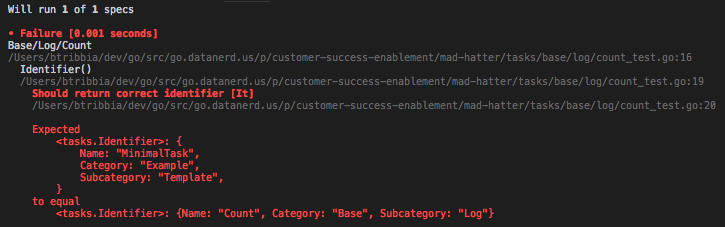
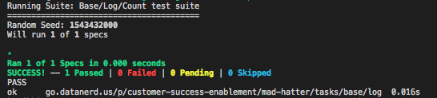
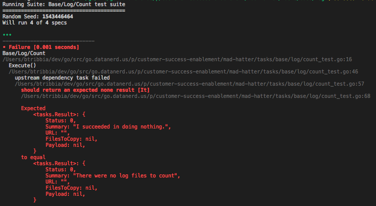

_This image will make sense in about 5 minutes._

# Unit Tests

We require contributors to provide unit test coverage for submitted NR Diag tasks. Test-driven Development (TDD) is one of the best ways introduce test coverage while writing readable, maintainable, and high quality code.

It is recommended you plan out your task to use separate methods that are then invoked in your task's `Execute()` method. 
You can then write unit tests for each of those individual methods. 

The `./test.sh` script has already been written to find and execute all unit tests so all you should need to do is create your `*_test.go` file and populate it to ensure your unit tests are run:

Your task:

```
versionCheck.go
```

Your test file for that task:

```
versionCheck_test.go
```

# Basic intro to TDD process

Test-driven development (TDD) is an approach to software development where you **write tests first**, then use those tests to drive the design and development of your software application. Unit testing (not integration testing) is what you will be using with TDD.

You should read the following article before moving forward with this readme:
[https://www.jamesshore.com/Blog/Red-Green-Refactor.html](https://www.jamesshore.com/Blog/Red-Green-Refactor.html)

# Getting setup with Ginkgo

[Ginkgo](http://onsi.github.io/ginkgo/) is the Go testing framework we use for unit testing in NR Diag. We'll be using it to write unit tests in this tutorial.

You can install Ginkgo by running the following commands in your terminal:

```
$ go get github.com/onsi/ginkgo/ginkgo
$ go get github.com/onsi/gomega/...
```

# Writing unit tests

Let's walk through real world example writing unit tests, where we will:

* Create a new task that returns the number of log files collected.
* Use [Test-driven Development](https://www.jamesshore.com/Blog/Red-Green-Refactor.html) to write actual tests with Ginkgo.

--------

## Section 1: Getting started with TDD to test Identifer()

First let's copy over an example template into the directory where our task will live in `tasks/base/log/`.

```
$ cp tasks/example/template/minimal_task.go tasks/base/log/count.go
```

Open up `tasks/base/log/count.go` and change the task struct name and references accordingly: `ExampleTemplateMinimalTask` -> `BaseLogCount`. 

Make sure to change the `package` name at the top to from `template` to `log` to match the package to which our task belongs. This is indicated by the directory it lives in (`tasks/base/log`)

Your `Identifier` method currently looks like this:

```go
func (p BaseLogCount) Identifier() tasks.Identifier {
	return tasks.IdentifierFromString("Example/Template/MinimalTask")
}
```

The `Identifier` for our task should return a meaningful identifier (`Base/Log/Count`), but this method is still returning the identifier from the template! We'll need to change that.

Since we're all about test driven development, let's write the test first! 🎉 😎

While testing a function that returns a string might seem unnecessary, if anyone ever accidentally changes the identifier, our test will call attention to the change.

Let's create the test file:

```
$ touch tasks/base/log/count_test.go
```

Let's add the initial Ginkgo scaffolding to this file:

```go
package log

import (
	"testing"

	. "github.com/onsi/ginkgo"
	. "github.com/onsi/gomega"
)

func TestBaseLogCount(t *testing.T) {
	RegisterFailHandler(Fail)
	RunSpecs(t, "Base/Log/Count test suite")
}

var _ = Describe("Base/Log/Count", func() {
	var p BaseLogCount //instance of our task struct to be used in tests

	//Tests go here!
})
```


Within our `"Base/Log/Count"` let's first use another `Describe()` to describe the code we're testing: `Identifier()`:

```go
Describe("Identifier()", func() {

})
```

Within that, let's write **our first test!**. This is done by using Ginkgo's `It()` function:

```go
It("Should return correct identifier", func() {
  ...
})
```

`It()` functions are the tests themselves and describe the behavior we expect from the function we're testing. 

Let's create an expected result that looks like the value our task's `Identifier()` method should return. Then let's write an `Expect()` call to compare the expected result, with the actual result returned from `p.Identifer()`. Remember, `p` is the instance of our task that all tests will be using.

The finished test should look like:

```go
var _ = Describe("Base/Log/Count", func() {
	var p BaseLogCount

	Describe("Identifier()", func() {
		It("Should return correct identifier", func() {
			expectedIdentifier := tasks.Identifier{
				Category:    "Base",
				Subcategory: "Log",
				Name:        "Count",
			}

			Expect(p.Identifier()).To(Equal(expectedIdentifier))
		})

	})
})
```

`expectedIdentifier` represents the output we want from the Identifier method. 

We can then use `Expect()` to assert that `p.Identifier()` matches `expectedIdentifier`:

```go
Expect(p.Identifier()).To(Equal(expectedIdentifier))
```

> **Pro tip:** `Equal` is a matcher provided by Gomega. [Click here](https://onsi.github.io/gomega/#provided-matchers) for a list of matchers to use in your tests.


### **Next step: let's run our test!**

```
$ cd tasks/base/log
$ go test
```

Don't get too excited - it's going to **fail**. Remember, the problem we're solving here is that our identifier is returning the wrong value.  

Running a test and watching it fail is a key aspect of test driven development. If your test passes on the first run, that means you didn't write the test first!

Before actually running the test, it's helpful to call out:
1) Whether you think it will fail
2) Why it will fail

In our case, the test will fail because, while we have an `Identify` method, it's returning the wrong value. Running our test proves that:



This is the **RED** portion of the Red-Green-Refactor cycle of test driven development. Failing tests is a crucial part of the process.

Now, let's move on to the **GREEN** - doing the bare minimum with our code so that our test passes. Test driven development is all about baby steps, so this could be as simple as hardcoding a return to get the test to pass. 

In this case, our method is very simple, so there aren't many shortcuts that can be taken. 

We'll need to edit the `Identify` method so that it returns the correct value:

```go
func (p BaseLogCount) Identifier() tasks.Identifier {
	return tasks.IdentifierFromString("Base/Log/Count")
}
```
Running our tests again:

```
$ go test
```



Woohoo! Our test passed! We're in the green. 

If this were a more complex method, we'd now go back and **REFACTOR**, using this test as a guide to show that we're on the right track.

Using the **RED-GREEN-REFACTOR** cycle over and over, small pieces of functionality can be added to a program with confidence.

Next we'll be using TDD to write the task's `Execute()` method.

However, before moving on to the next section, you should use TDD to write the task's the `Explain()` and `Dependencies()`

> Hint: Our task will use `Base/Log/Collect` as an upstream dependency. We need to know which logs were collected in order to count them.

## Section 2: Testing Execute()

We know this task is going to return a result with the count of collected logs. So we expect the task's execute function to return a `tasks.Result` instance with this information. 

Here is an example of what our `Execute()` function might return if it were successful:

```go
tasks.Result{
	Status: tasks.Succcess,
	Summary: "4 log files collected"
	Payload: 4
}
```

Alright, let's write our tests! With `Execute()`, it will be a bit more complicated because:

* `Execute()` takes parameters that we will need to control for in our tests. Changing these parameters will generate specific contexts for our tests:
  * upstream dependency task failed
  * upstream dependency returned unexpected payload type (type assertion failure)
  * one or more log files found by upstream dependency
  * no log files found by upstream dependency


* The parameter we'll be modifying is called `upstream`. We'll want to create fixtures that correspond to each of the above contexts. This will be done using Ginkgo's `BeforeEach()` method.

* We know we're going to be calling `p.Execute()` for each test, so we'll us Ginkgo's `JustBeforeEach()` to call this just before each test is run, getting a fresh result each time.

That may seem like a lot of complexity, but the pattern becomes very natural after a few iterations. We promise!

### **Our first context: upstream dependency task failed**

Here is a basic structure using the first context mentioned above ("upstream dependency task failed")

```go
Describe("Execute()", func() {
	var (
		result   tasks.Result
		options  tasks.Options
		upstream map[string]tasks.Result
	)

	JustBeforeEach(func() {
		result = p.Execute(options, upstream)
	})

	Context("when upstream dependency task failed", func() {

		BeforeEach(func() {
			options = tasks.Options{}
			upstream = map[string]tasks.Result{
				"Base/Log/Collect": tasks.Result{
					Status: tasks.Failure,
				},
			}
		})

		It("should return an expected none result status", func() {
			Expect(result.Status).To(Equal(tasks.None))
		})

		It("should return an expected none result summary", func() {
			Expect(result.Summary).To(Equal("There were no log files to count"))
		})
	})
})
```

Within the `Describe("Execute()", func(){...})` block, for each test (`It()`) that is defined:

1. Each context's `BeforeEach()` is executed to set its `upstream` value.
2. `JustBeforeEach()` runs `Execute()` and assigns its output to the `result` variable.
3. The actual tests' (`It()`) functions compare the `result` to the expected result properties.

These tests effectively read as:

* `"Execute(), when upstream dependency task failed, it should return an expected none result status"`
* `"Execute(), when upstream dependency task failed, it should return an expected none result summary"`

We're declaring variables at the top of the `Describe()` block so that `BeforeEach()`, `JustBeforeEach()`, can modify values available to `It()`.

So let's run the test and watch it fail:



Now let's modify the execute function in our task (`tasks/base/log/count.go`) to pass this test:

```go
func (p BaseLogCount) Execute(options tasks.Options, upstream map[string]tasks.Result) tasks.Result {
	var result tasks.Result

	// Check if upstream depedency task status is a failure
	if upstream["Base/Log/Collect"].Status == tasks.Failure {
		result = tasks.Result{
			Status:  tasks.None,
			Summary: "There were no log files to count",
		}
		return result
	}

	return result
}
```

We can run our tests again:


Success! 👍

-----

## Moving forward

Here is our task context check list so far:

  * ~~upstream dependency task failed~~
  * upstream dependency returned unexpected payload type (type assertion failure)
  * one or more log files found by upstream dependency
  * no log files found by upstream dependency


Now we encourage you to go forth and use TDD to finish the task's `Execute()` function for the remaining 3 contexts. As a hint, here are what your `upstream` fixtures should look like for each of the 3 contexts:


**upstream dependency returned unexpected payload type (type assertion failure)**

```go
upstream = map[string]tasks.Result{
	"Base/Log/Collect": tasks.Result{
		Status:  tasks.Success,
		Payload: "This should be of type []LogElement, but it's a string instead",
	},
}
```

**one or more log files found by upstream dependency**

```go
upstream = map[string]tasks.Result{
	"Base/Log/Collect": tasks.Result{
		Status: tasks.Info,
		Payload: []LogElement{
			{
				FileName: "newrelic.log",
				FilePath: "/",
			},
		},
	},
}
```

**no log files found by upstream dependency**

```go
upstream = map[string]tasks.Result{
	"Base/Log/Collect": tasks.Result{
		Status:  tasks.Info,
		Payload: []LogElement{},
	},
}
```

If you would like to check your work and see the finished task and task_test files, we have them available here:

* [Completed `count.go`](../tasks/example/docs/completed_count.go)
* [Completed `count_test.go`](../tasks/example/docs/completed_count_test.go)

> **NOTE:** You may notice `[]LogElement{}` is changed to `[]log.LogElement{}` in the above two files. In order to avoid this example task being a part of NR Diag itself,  the two example files live in the `tasks/example/docs/` folder and are thus part of the `docs` package, instead of the `log` package.

# Dependency injection

Dependency injection helps us write more testable code by passing in external dependencies when our code is called. This practice allows us to use mock dependencies when running tests, and real dependencies when in production.

Using dependency injection is especially useful when writing unit tests for your task's `Execute()` function.

For an example of how you can use this in NR Diag, see the [Dependency Injection readme](Dependency-Injection.md)
